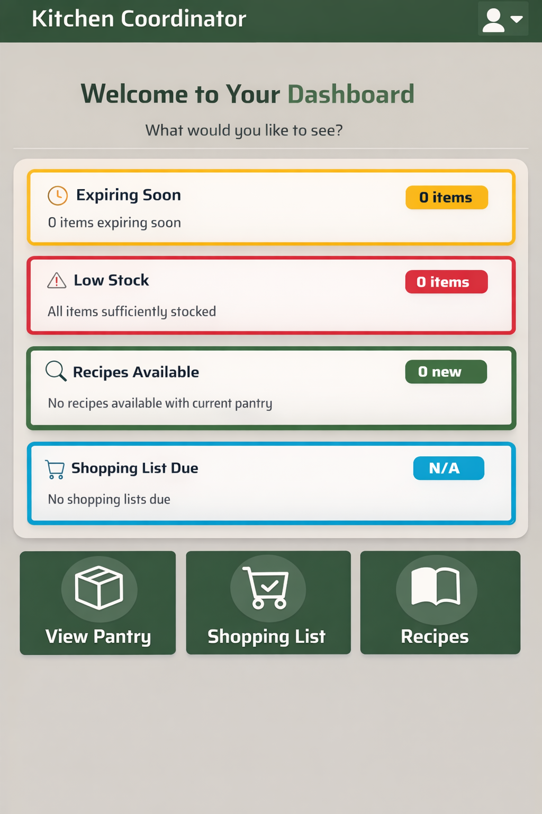
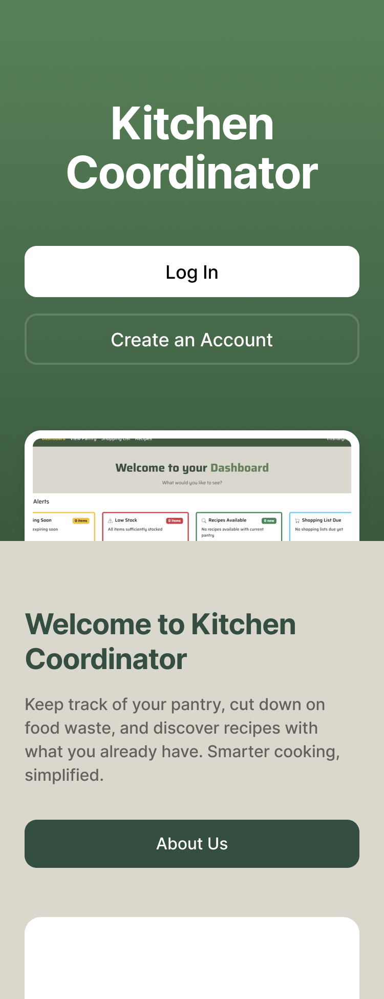
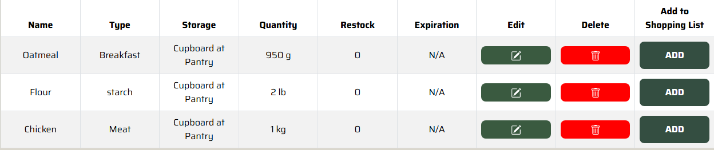

# Kitchen-Coordinator 

## Table of Contents
1. [Overview](#overview)
2. [Deployment](#deployment)
3. [Team Contract](#team-contract)
4. [User Guide](#user-guide)
5. [Developer Guide](#developer-guide)
6. [Development Team](#development-team)
7. [Milestones](#milestones)
     - [Milestone 1 Progress](#milestone-1-progress)
     - [Milestone 2 Progress](#milestone-2-progress)


<!--
comment out add in later as we progress through project
* [User Guide](#user-guide)
* [Community Feedback](#community-feedback)
* [Developer Guide](#developer-guide)
* [Development History](#development-history)
* [Continuous Integration](#continuous-integration)
* [Walkthrough videos](#walkthrough-videos)
* [Example enhancements](#example-enhancements)
* [Team](#team)
-->

---

## Overview

### Problem
_What's the point of a pantry app?_
- People often forget what they have in their pantry, fridge, or spice rack
- Expired food leads to waste and wasted money 
- Grocery shopping is inefficient without knowing what's already at home

### Approach
- Create a digital inventory system for pantry, fridge, freezer, and spices
- Allow users to easily add, remove, and update items
- Automatically generate shopping lists when items are low or missing
- Simple and clean interface so it's quick to use every day

### Use Case Ideas
- Before going to the store, check what items are low or expired
- While cooking, search the app to see if you have a specific ingredient
- Share the pantry list with family or roomates so everyone is synced
- Use expiration reminders to finish food before it spoils

### Beyond the Basics
- Barcode scanner for quick item entry
- Recipe suggestions based on available ingredients 
- Reports that show spending trends and reduce food waste
- Possible integration with smart home assistance like Alexa or Google Assistant

## Deployment

---

## Team Contract
[Link to Team Contract](https://docs.google.com/document/d/1VzBkSbz36BjpE7QcRbgKxxXCnpzzko8UlDvcngXWB2k/edit?tab=t.)


---
## Credits and Attribution 
This project is forked off of the [Pantry Pals appliction](https://github.com/pantry-pals/pantry-pal). This project builds upon the code with additional features.

---
## User Guide
An intro to using pantry pals  

### Sign in page
Sign up for pantry pals and verify your email to sign in


### Dashboard
Users have easy access to all pages through Pantry Pal's dashboard


### View your pantry
Pantry pals allows you to easily keep track of what ingredients you have in your household, where they are, and how much of them you have left


### Add and Edit your pantry
Keep track of your spices and food by adding them to your pantry  


### Create Shopping Lists
Easily create and manage your shopping list based on what’s running low in your pantry. Check off items as you shop to keep your inventory up to date.


### Find Recipes
Discover recipes you can make with the ingredients you already have. Pantry Pals helps you reduce waste and find meal ideas tailored to your pantry.


---

## Developer Guide
This section provides information of interest to developers wishing to use this code base as a basis for their own development tasks.

### Installation
First, install [Node.js](https://nodejs.org/en/download/)

Second, visit the [Kitchen-Coordinator application github page](https://github.com/kitchen-coordinator/kitchen-coordinator), and click the “Use this template” button to create your own repository initialized with a copy of this application. Alternatively, you can download the sources as a zip file or make a fork of the repo. However you do it, download a copy of the repo to your local computer.

Third, cd into the pantry-pal directory and install libraries with:
```
$ npm install
```

Fourth, run the system with:
```
$ npm run dev
```

If all goes well, the application will appear at [http://localhost:3000](http://localhost:3000).

### Application Design
Kitchen-Coordinator is based upon the ICS Software Engineering [Next.js Application Template](https://github.com/ics-software-engineering/nextjs-application-template).

---

## Milestones
  * [Milestone 1 Progress](#milestone-1-progress)
  * [Milestone 2 Progress](#milestone-2-progress)

### Milestone 1 Progress

Milestone 1 was all about setting up a solid foundation for **Kitchen-Coordinator**, both technically and from a user experience standpoint.

Here’s what we accomplished:

- **Mobile-friendly design mockups**  
  We created three new mobile mockup pages that rethink some of the core views (pantry, dashboard, and landing page) using card-based layouts and mobile-first interactions to make the app easier to use on smaller screens.

  ### Pantry Mobile Mockup
  

  ### Dashboard Mobile Mockup
    

  ### Landing Page Mockup
    

- **Rebranding the project**  
  We rebranded the application from Pantry Pals to **Kitchen-Coordinator**, updating the name and documentation to reflect that this is now our own project and direction.

- **Updated user stories**  
  We refined and clarified our user stories, which helped us better understand core features and streamline our development process.

- **Database setup and deployment**  
  We connected the app to a database and deployed it using Vercel, giving us persistent data storage and a live version of the app to work with.

- **Improved developer documentation**  
  We cleaned up and expanded the README to make the Developer Guide clearer and easier to follow for anyone setting up the project.

### Milestone 1 Progress
- [Milestone 1 Project Board](https://github.com/orgs/kitchen-coordinator/projects/3)

Overall, Milestone 1 gave us a strong starting point and helped align both our technical setup and design direction.

---

### Milestone 2 Progress

# Milestone 2 Progress

Milestone 2 was all about improving functionality, usability, and overall polish. We focused on making unit handling smarter, strengthening our testing setup, and moving closer to a scalable two-tier quantity system.

---

## What We Explored

During this milestone, we:

- Explored hard-coded standard unit conversions and what that means for safety vs scalability.
- Looked into implementing a true two-tier quantity system (store in base units, display in user-friendly units).
- Evaluated tradeoffs between same-metric conversions (mass → mass, volume → volume) and cross-metric conversions (mass ↔ volume).
- Considered where conversion logic should live and how future user-defined mappings would impact performance and structure.

This helped us understand how to keep conversions clean, centralized, and safe.

---

# Unit Conversion Utility Implementation

We implemented a reusable unit conversion utility that allows consistent conversions across the project.

This utility:

- Normalizes user-entered units (kg, g, lb, fl_oz, tsp, L, etc.)
- Converts values into base units (grams for mass, milliliters for volume)
- Enables proper sorting and comparison across mixed units
- Reduces duplicate conversion logic across components

We integrated this directly into **View Pantry**, which now sorts items correctly even if they use different units.

---
## Previous – Mass Sorting



---

## Previous – Volume Sorting


---

## Now - Mass Sorting Example

Mixed mass units (kg, g, lb) now sort correctly.


---

## Now - Volume Sorting Example

Mixed volume units (fl oz, L, tsp) now sort correctly.


---

# Testing & CI Improvements

We also strengthened reliability during this milestone:

- Added acceptance testing with **TestCafe**
- Set up **GitHub Actions CI**
- Added a build/test status badge to the repository

Now every push automatically builds and tests the system.

---

# Where This Sets Us Up

This milestone moved the project from “basic functionality” toward something much more scalable and structured. 

Next steps include:

- Expanding the two-tier system
- Supporting user-defined unit mappings (e.g., 1 bag = 500g)
- Exploring density-based mass ↔ volume conversions
- Continuing UI improvements for mobile responsiveness

Milestone 2 helped lay the foundation for a more powerful and flexible pantry system.


📌 **Milestone 2 Project Board**  
- [Milestone 2 Project Board](https://github.com/orgs/kitchen-coordinator/projects/4/views/1)

Milestone 2 is focused on making Kitchen-Coordinator more intuitive and practical for everyday use while strengthening the overall system.

---

# Milestone 3 Goals  
*(Architecture → Advanced Functionality → Performance → UX Refinement)*

Milestone 3 focuses on fully implementing and stabilizing the two-tier unit system, expanding conversion capabilities, improving performance, and refining the mobile experience.

---

## Complete Implementation of the Common Two-Tier Unit System

Move from exploration to full implementation.

**Goals:**
- Finalize the two-tier storage model (base unit + display unit)
- Implement user-input common items for reusable mappings
- Implement two-tier display logic inside Pantry
- Ensure all conversions route through a single source-of-truth utility
- Maintain backward compatibility with existing pantry data

---

## Density-Based Mass ↔ Volume Conversions

Move from exploration into real cross-category functionality.

**Goals:**
- Persist user-input density in the database
- Implement density-based conversion utility
- Integrate density conversions into pantry and recipe flows
- Add error handling for missing or invalid density
- Add test coverage for cross-metric conversions

---

## Mobile-First UI Expansion

Extend the mobile improvements started in Milestone 2.

**Goals:**
- Implement mobile-friendly design for Pantry
- Implement mobile-friendly design for Dashboard
- Implement mobile-friendly design for Landing Page
- Improve touch targets and simplify layout for small screens
- Reduce visual clutter introduced by new two-tier features

---

## Performance & UX Optimization

Address user experience polish and technical performance.

**Goals:**
- Investigate and reduce user login delay
- Research and implement improved preloader/loading states
- Optimize conversion performance (especially DB lookups for rules)
- Improve perceived performance during sorting and conversions

---

## Feature Expansion & Input Innovation

Begin expanding beyond core pantry input.

**Goals:**
- Research implementation of recipe scanner for pantry input
- Design a “Use” button workflow for consuming pantry items
- Ensure new workflows integrate cleanly with two-tier and density systems

---

## Milestone 3 Theme

If Milestone 2 was:

> “Make conversions work and improve structure.”

Then Milestone 3 is:

> “Make the system scalable, smart, and production-ready.”


## Development Team
- [Mishalyn Mei Ilmeng](https://github.com/mishalyn-mei-ilmeng)
- [Simon Lin](https://github.com/simonwlin)
- [Kwanho Chun](https://github.com/kwanhoc1)
- [Kawika Naweli](https://github.com/KawikaN)
- [Eli Thompson](https://github.com/EliThomp)


